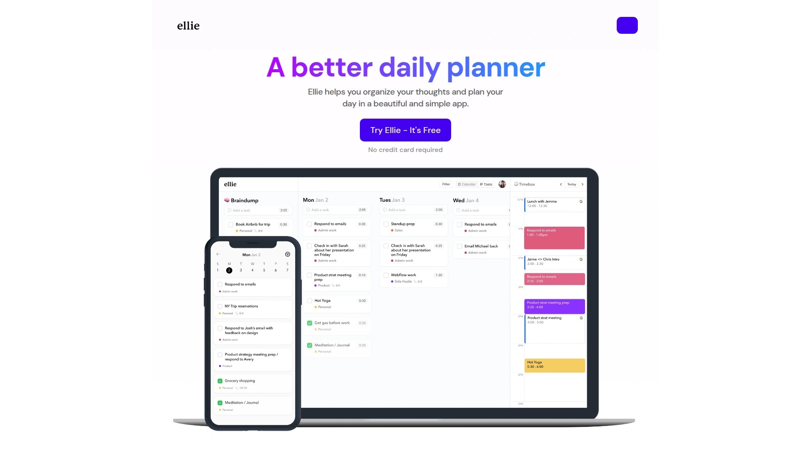
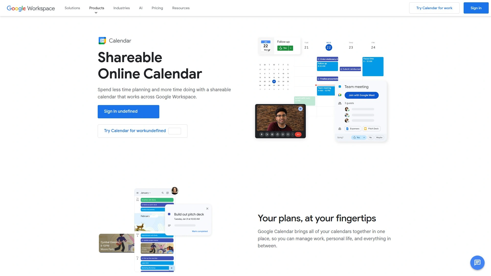
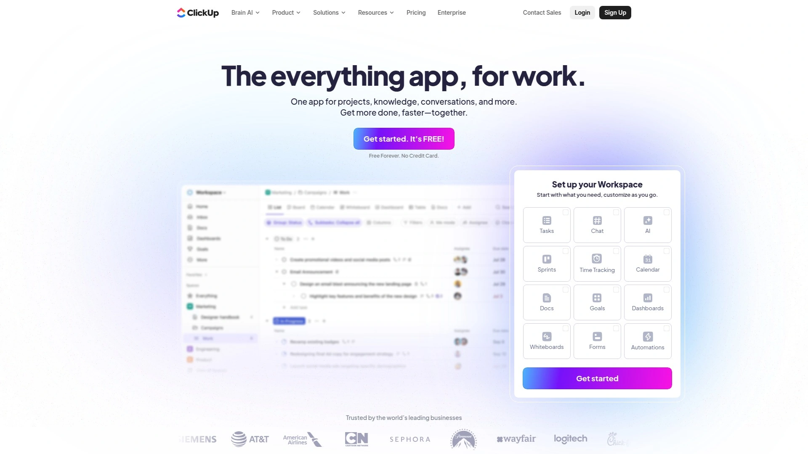

# 18 Top-Tier Daily Planning Tools You Must Know in 2025

Finding the right daily planning tool can transform how you approach your workday. Whether you're drowning in scattered tasks across multiple platforms or struggling to maintain focus throughout your day, the right software helps you regain control without adding complexity. These tools consolidate your calendar, tasks, and workflows into a single intelligent system that adapts to how you actually work—not how productivity gurus think you should work.

Modern daily planners go beyond basic to-do lists by offering time blocking, calendar integration, and smart scheduling features that help you see what fits into your day before you commit to it. The best ones connect seamlessly with tools you already use like Gmail, Slack, Asana, and Notion, creating a unified view of everything demanding your attention.

## **[Sunsama](https://www.sunsama.com)**

The mindful approach to daily planning that helps you end each workday feeling accomplished rather than overwhelmed.

Sunsama stands out by encouraging intentional planning rituals at the start and end of your day. The software pulls tasks from project management tools like Asana, Trello, and Jira, plus emails and Slack messages, into a focused daily plan that prevents you from feeling buried under endless backlogs. You timebox tasks directly onto your calendar while viewing all your meetings in one place, so you always know what realistically fits into today.

The platform automatically tracks where your time actually goes and visualizes your work on your calendar, helping you finish work on time without guilt. Users particularly appreciate the "Start Your Day" and "End Your Day" rituals that create natural boundaries and reflection points. The tool integrates with calendar apps, task managers, email clients, and messaging platforms to become your single source of truth.

**Best for:** Professionals transitioning from paper planners who value spending 10-20 minutes thoughtfully planning their day rather than constantly reacting to incoming demands.

## **[Motion](https://www.usemotion.com)**

AI-powered project management that automatically schedules your tasks and predicts when work will actually get done.

Motion uses artificial intelligence to build your daily schedule by considering your entire calendar—meetings, personal appointments, deadlines, and task priorities. The AI automatically reschedules tasks when things change, keeping you on track without manual replanning. Motion recently added AI Employees that can handle tasks like writing blog posts, creating social content, and drafting email responses.

The platform offers Kanban board views for visual project tracking and automatically sequences dependent tasks in the correct order. If you miss a task, Motion reschedules it automatically so nothing gets lost. The software works particularly well for teams needing full project management capabilities alongside individual daily planning.

Motion's calendar function uses AI to automatically rearrange events and optimize your schedule, continuously learning from your behavior and preferences. The system can handle complex project management with task dependencies and deadline forecasting.

**Pricing:** Business Starter at $6/user/month, Business Standard at $12/user/month, Business Plus at $18/user/month when billed annually.

## **[Akiflow](https://akiflow.com)**

Keyboard-first time blocking for people who want complete manual control over their schedule with powerful integrations.

Akiflow provides straightforward manual task scheduling where you decide the timing, priority, and duration of every task. The flexibility to snooze, move, or delete tasks makes it perfect for those who want complete control without relying on AI automation. You can organize tasks with folders and tags, break projects into smaller tasks, and maintain an easy-to-navigate structure.

The platform has the most robust API among daily planners, enabling powerful custom workflows through Zapier. For example, when a new lead appears in your CRM, you can automatically create a follow-up task in Akiflow. The tool integrates natively with numerous business tools and serves as a central hub for all your to-dos across Gmail, Notion, Asana, and Slack.

**Best for:** Users who already have a project management system and crave a daily planning layer with extensive customization options and keyboard shortcuts for rapid task management.

**Trial:** 7-day free trial available.

## **[Routine](https://routine.co)**

Free daily planner with a focused "Today" view that reduces overwhelm by showing only what you planned for right now.

Routine integrates with your calendar to pull in events and connects with Notion to import tasks. The focused today view displays only items planned for the current day, which dramatically reduces overwhelm compared to endless scrolling through massive backlogs. Time blocking works seamlessly with this minimalist, clean interface.

You organize tasks within pages rather than traditional folders, where you can create notes alongside your tasks. This page-based organization offers an interesting alternative to conventional task management structures. The app has a comprehensive free plan that costs nothing.

The minimalist design appeals to users seeking simplicity without overwhelming features. While it lacks easy color-coding options in the calendar view, the roadmap promises exciting features coming soon.

**Pricing:** Free plan available, paid plans start at $10/month.

## **[Morgen](https://www.morgen.so)**

All-in-one calendar and task manager that offers AI planning assistance you preview and approve before it touches your schedule.

Morgen combines multiple calendars from different platforms into one unified view for easy organization. The AI Planner designs your days based on your capacity, priorities, and work preferences, but you always preview, adjust, and approve plans before they're scheduled. This gives you AI benefits without surrendering control of your time.

The platform schedules breaks and buffer time, rounds up time estimates, and splits big tasks into manageable work sessions. Morgen adapts plans as your schedule changes and notifies you of conflicts, incomplete tasks, and at-risk deadlines. Task integration merges items from various management tools into one place.

The software works across multiple operating systems with consistent functionality and features a clean, intuitive interface. Advanced scheduling tools include time blocking and smart scheduling to improve time management. Offline functionality ensures you can access calendars and tasks without internet connection.

**Target users:** People who want AI scheduling suggestions but need to maintain final approval over what gets scheduled and when.

## **[TickTick](https://ticktick.com)**

Flexible time-blocking planner that blends to-dos, calendars, habits, and a built-in Pomodoro timer across every device.

TickTick allows drag-and-drop task scheduling directly into your calendar for smooth time blocking. The built-in Pomodoro timer tracks how long you actually work, helping you lock in when focus matters. Recurring habits let you set up routines like workouts, writing sessions, or weekly reviews.

Calendar sync connects with Google and Outlook to keep everything consolidated in one place. The app works across mobile devices, desktop, and even Apple Watch. Time blocking flows naturally without friction.

The calendar view is only available on desktop with the Premium plan, which may limit mobile users. No built-in AI assistant means you can't simply tell it to schedule focus time automatically like some competitors. Not ideal for complex project management as it lacks timeline views or task dependencies.

**Pricing:** Free plan available, Premium plan costs $35.99/year (approximately $3/month), with discounted education plans for students and teachers.

## **[Todoist](https://todoist.com)**

Straightforward task management with natural language processing, multiple views, and flexible planning approaches.

Todoist offers lists, Kanban boards, and time-blocking calendar views that make sense for most working styles. The Inbox serves as the default location for new tasks that you can sort later into projects and schedules. Today view shows tasks due or scheduled for the current day, with easy rescheduling through drag-and-drop.

Natural language processing is particularly robust, allowing you to set due times, priorities, labels, project assignments, and collaborator assignments all through everyday language. For example, typing "Meeting with Ada tod 9:30 !30min p1" creates a high-priority task for today at 9:30 AM with a 30-minute advance reminder.

The Upcoming view helps preview and manage tasks due in the next week or beyond. Priorities (!1, !2, !3) indicate task importance while labels enable easy batching of similar tasks. The three-view approach emphasizes flexibility for people who frequently reschedule and adjust plans.

**Best for:** Users wanting straightforward task capture with powerful natural language input and flexible views without overwhelming complexity.

## **[Amie](https://amie.so)**

Beautifully designed calendar app for iOS with natural language event creation and AI-powered task suggestions.

Amie uses Natural Language Processing to add events by typing simple phrases like "Go to the grocery store @this Sunday at 3:00 p.m." which automatically places them on your calendar with time blocking. The AI Chat feature understands context—saying "Do house repairs on Sunday" automatically schedules several hours because the system knows such tasks take time.

Smart task suggestions optimize your day by finding the best time slots based on your existing schedule. For busy periods, it locates open slots for activities like responding to emails or making phone calls. Color-coding keeps events organized at a glance, while the built-in Pomodoro Timer helps maintain focus.

The app integrates with email allowing drag-and-drop from inbox to task list, plus connects with Apple Health for fitness tracking and Spotify for listening activity. Split-view scheduling and drag-and-drop make moving tasks effortless. Scheduling links eliminate back-and-forth emails when coordinating with others.

**Drawback:** Currently no Android version available.

**Pricing:** Pro plan at $13.60/month per user, with custom Enterprise pricing.

## **[Reclaim.ai](https://reclaim.ai)**

AI calendar assistant that uses flexible time blocking to automatically find the best time for tasks, meetings, and breaks.

Reclaim creates flexible time holds for tasks, routines, meetings, and breaks that automatically lock into place as your schedule fills up. This maximizes availability for meetings while defending time for things you need to accomplish. You can set priority levels for any calendar event so the system makes automatic tradeoffs around what matters most.

When conflicts arise, Reclaim completely reshuffles your schedule around highest priority items. The platform allows personalizing time blocks with dedicated features for Tasks and recurring Habits, giving schedulers and team members insight into your priorities so they're less likely to interrupt working sessions.

The system works with Google Calendar and Microsoft Outlook. Reclaim automatically reschedules tasks as things change throughout your day. The tool focuses primarily on individual use rather than team-wide optimization.

**Recently completed:** SOC2 Type II certification for enhanced security.

## **[Clockwise](https://www.getclockwise.com)**

Team calendar optimization that creates Focus Time by automatically moving flexible meetings to better slots.

Clockwise runs up to one million calendar permutations per team per day to resolve scheduling conflicts and maximize uninterrupted Focus Time. The AI continuously optimizes calendars for you and your teammates to create the best possible schedule for everyone. A browser extension for Google Calendar brings powerful features into an interface you already know.

The platform is designed for team-wide calendar management rather than just individual time blocking. It ensures users have enough Focus Time each week to tackle important projects by moving meetings that have flexibility in their timing. The system blocks time on your calendar while also creating protected focus periods.

Security offerings include SOC2 Type II certification, GDPR compliance, CCPA compliance, and SCC compliance. Configurable processing options limit data access as needed. SCIM and advanced billing features help IT professionals automatically provision and de-provision accounts.

**Impact metrics:** Creates additional hours of Focus Time for deep work and resolves meeting conflicts to make time for what matters.

## **[Ellie Planner](https://ellieplanner.com)**

Beautiful daily planning app with an "Infinite" Kanban week view and optional calendar integration.

Ellie features time blocking capabilities that work completely separately from your calendar if desired, with optional Google or Apple calendar integration later. The Infinite Kanban week view and Timebox features are specifically built for daily planning and time management. Native iOS and iPad apps include the majority of Ellie features with one of the best mobile time blocking experiences available.

The app emphasizes the "Brain dump" feature and offers flexible Ellie lists that users regularly praise. You can use Ellie without connecting external calendars, making it ideal for people who want planning tools separate from their meeting schedules. The design prioritizes beauty and simplicity.

AI Assistant helps manage tasks, organize schedules, and stay on top of daily planning through natural conversation. The software suits people who've developed their own planning systems in Notion or spreadsheets and want dedicated tools.

**Best for:** Users who like timeboxing their day on calendars and those who get overwhelmed by excessive daily tasks.

## **[TimeHero](https://www.timehero.com)**

Smart work management that automatically schedules recurring tasks and uses AI to plan around your busy schedule.

TimeHero features autonomous recurring tasks that self-plan within given timeframes. Smart workflow templates include task and event dependencies, letting you plan team projects in seconds while ensuring processes are followed. Built-in time tracking allows starting timers from anywhere with multi-tasking throughout the day.

Automatic risk detection alerts you when tasks schedule too close to due dates, helping decide when to stick to schedules or be flexible. Project forecasting shows how schedules look in the future for better decisions about reassignments, priorities, and realistic estimates. Capacity and workload tracking monitors progress in real-time as tasks complete.

The platform connects to over 1,000 popular applications through Zapier to capture and schedule tasks automatically. Managers gain visibility into when work happens, not just when it's due, requiring fewer status meetings.

**Target users:** Teams, client-facing professionals, and solo workers who need automated planning that adapts to changing schedules.

## **[Google Calendar](https://calendar.google.com)**

Free time blocking foundation that integrates seamlessly with Google Workspace and thousands of third-party tools.

Google Calendar allows creating multiple calendars within the app to map out your entire day from start to finish. You can maintain dedicated calendars for work, personal commitments, and side projects with a comprehensive schedule view. Integration with other Google apps makes scheduling appointments and sending meeting invitations seamless.

The premium version includes appointment scheduling features handy for coordinating with colleagues or clients. Events in Gmail automatically add to your calendar. Shareable online calendars and external calendar migration keep everything synchronized.

Google Tasks integration allows basic task scheduling, though tasks can only be scheduled in 30-minute increments. This limitation frustrates users attempting to block time for smaller activities. The integration strength with Google Workspace can be limiting for those preferring third-party productivity tools.

**Pricing:** Free to use, or included in Google Workspace plans starting at $6/user/month for Business Starter.

## **[Toggl Track](https://toggl.com)**

Time tracking software that builds custom reports from team data to maximize productivity and calculate profitability.

Toggl Track features calendar integration that copies time entries into your workspace. Track time from web, desktop apps, mobile apps, and browser extensions across all devices. Background tracking for any app or website allows team members to convert activity into time entries for reporting while keeping it private to them.

The platform plugs into popular tools like Jira, Salesforce, and Asana, plus uses an API to custom-fit into your tech stack. Data-driven and highly customizable reports show where your team spends time and pinpoint productivity gaps. The user-friendly interface saves teams significant time monthly.

One agency achieved 100% time tracking adoption across a team of 500+ users. Another organization experienced 6X team growth while maintaining work-life balance by avoiding intrusive monitoring like screenshot capture.

**Trial:** 30-day free trial for all features with no credit card required.

## **[Upbase](https://upbase.io)**

Time-blocking app with generous free version and multiple calendar views that combines time blocking with other productivity methods.

Upbase offers multiple time-blocked calendar views including Daily Planner and Weekly Calendar where you can drag-and-drop tasks to adjust durations and assign different color codes. Creating new tasks takes just a few clicks regardless of calendar view. You can create to-do lists, break down tasks into smaller steps, and prioritize them.

The Pomodoro Timer integrates the popular Pomodoro technique to prevent procrastination and boost focus. The generous free version provides access to core time blocking features without cost. Drag-and-drop interface makes scheduling tasks faster.

The platform lets you combine time blocking with other time management methods to multiply your productivity level. Multiple calendar views give more flexibility than competitors that only offer daily views.

**Best for:** Users wanting to experiment with combining different time management techniques in one platform.

## **[Things 3](https://culturedcode.com/things/)**

Apple-exclusive task manager with intuitive Quick Entry and elegant four-view planning approach.

Things 3 offers Quick Entry by pressing Ctrl-Space to invoke a window where you swiftly create tasks without extensive navigation. Natural language input uses everyday language to set deadlines, add reminders, or schedule tasks. You can set start dates indicating when you'll begin tasks, which proves handy for planning and time-blocking your day.

The four-view planning approach includes Someday for unimportant tasks without dates, Anytime for important tasks without dates, Today & This Evening for current day tasks, and Upcoming for tasks in the next seven days or months. This structured approach suits proactive planners.

Mobile task capture ensures you never miss adding tasks on-the-go. The interface maintains Apple's design philosophy with clean, intuitive interactions.

**Limitation:** Only available for Apple devices—no Windows or Android versions.

## **[Any.do](https://www.any.do)**

Task management with collaborative options suitable for personal and team productivity.

Any.do provides task management capabilities with collaboration features that work for both individual users and teams. The platform includes calendar integration for viewing tasks alongside scheduled events. Task organization uses lists and reminders to keep everything organized.

The app works across multiple platforms maintaining consistent access to your tasks. Collaboration features allow sharing lists and assigning tasks to team members. Integration with calendars helps visualize when tasks need completion.

Natural language input simplifies adding tasks by typing what you need in everyday language. The interface balances simplicity with functionality for straightforward task management.

**Best for:** Users seeking collaborative task management without overwhelming complexity.

## **[ClickUp](https://clickup.com)**

Comprehensive work management platform with customizable views, extensive integrations, and calendar functionality.

ClickUp provides multiple task views including Board and Calendar that help visualize work in different ways. The comprehensive dashboard offers clear project overviews with task tracking, goal setting, and team performance insights. Time tracking tools allow setting estimated times for tasks to improve time management and resource allocation.

Customization options let teams adapt the platform to their specific workflows, though this comes with a steeper learning curve. The variety of views initially overwhelms new users but becomes powerful once mastered. Integrations connect numerous other apps, though not as extensive as some specialized tools.

ClickUp Calendar View lets users integrate calendars together and schedule work more effectively. Customizable templates provide starting points for various project types. The platform turns conversations into actionable tasks across tasks, chats, and docs.

**Best for:** Teams needing customizable task management willing to invest time learning the platform.

## **[Notion Calendar](https://www.notion.so/product/calendar)**

Calendar application with deep Notion integration for managing meetings and connecting events to project notes.

Notion Calendar, previously known as Cron Calendar, integrates closely with Notion documents. Google Calendar integration allows seamlessly connecting and managing events within a unified interface. You can link calendar events to specific Notion pages, facilitating better organization and access to related notes, tasks, or documents.

Meeting booking functionality includes options for recurring meetings, sending invitations, and managing RSVPs. Video conferencing links work with Zoom and Google Meet. Color coding supports time blocking to visualize your day.

The clean, minimalist design appeals to users seeking simplicity. Deep integration with Notion databases makes it powerful for those already using Notion for project management. However, it may lack the depth required for complex task management outside the Notion ecosystem.

**Best for:** Existing Notion users who want calendar functionality tightly integrated with their project documentation.

---

## FAQ

**Which daily planner works best for teams versus individuals?**

Motion and Clockwise excel for teams with automatic scheduling and calendar optimization across multiple people, while Sunsama, Routine, and Ellie Planner focus on individual daily planning rituals. Akiflow bridges both worlds by serving as a personal planning layer on top of team project management tools.

**Can these tools replace my existing project management software?**

Motion and ClickUp offer full project management capabilities that could replace dedicated PM tools, while Sunsama, Akiflow, and Morgen are designed to complement existing systems by pulling tasks into a focused daily view. Choose based on whether you need comprehensive project tracking or just daily planning focus.

**What's the learning curve difference between AI-powered and manual planners?**

AI-powered tools like Motion and Reclaim require trusting the algorithm and adjusting settings to match your preferences initially, while manual planners like Akiflow and TickTick give immediate control but demand more active management. Morgen offers a middle path with AI suggestions you approve before scheduling.

---

## Conclusion

The right daily planning tool transforms chaos into clarity by consolidating scattered tasks, integrating your existing workflow, and helping you see what actually fits into your day. **[Sunsama](https://www.sunsama.com)** stands out for professionals who value mindful planning rituals and want to end each day feeling accomplished rather than overwhelmed by encouraging intentional time blocking and reflection. Whether you choose AI automation or manual control depends on your working style, but the tools in this collection offer proven approaches to reclaiming your time and focus in 2025.
